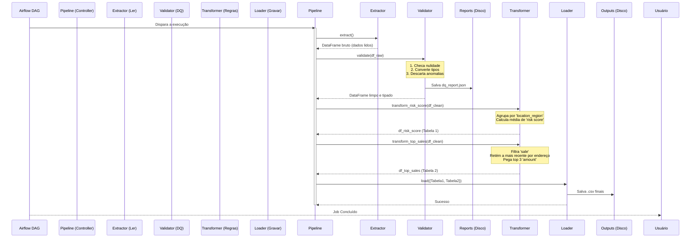
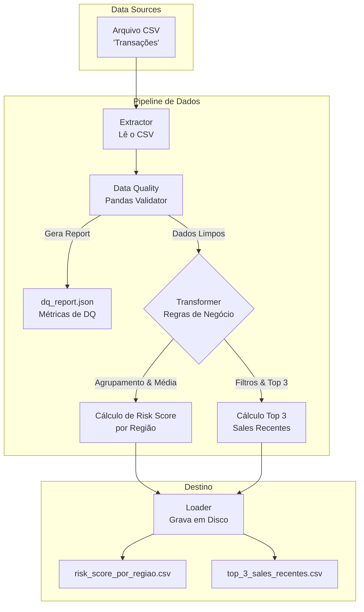

# 🚗 Locadora de Carros - Data Pipeline

Este projeto é uma solução de Engenharia de Dados para o processamento, limpeza e análise de dados de transações de uma locadora de carros. Ele foi desenvolvido com foco em alta confiabilidade, aplicando princípios **SOLID**, **Programação Orientada a Objetos (OOP)**, conteinerização via **Docker** e orquestração automatizada via **Apache Airflow**.

## 🏗️ Arquitetura e Componentes (Visão Granular)

A solução foi pensada de maneira modular (SOLID). Cada módulo da aplicação tem uma responsabilidade única, e as dependências são baseadas em abstrações (Interfaces).



### Fluxo Funcional de Processamento
Este diagrama mostra o caminho dos dados, de ponta a ponta:



### Explicação Granular de Cada Etapa:
1. **Extractor:** Lê o arquivo original (CSV) do disco ou storage. Ele foi projetado usando injeção de dependência (`ExtractorInterface`), de modo que pode ser facilmente trocado por uma conexão de banco de dados sem quebrar o sistema.
2. **Validator (Quality & Cleanse):** Recebe o dado bruto e processa regras de conformidade utilizando Pandas. Tipos inconsistentes são reportados. Um arquivo `dq_report.json` é persistido indicando a quantidade de registros válidos e percentual de conformidade.
3. **Transformer (Core Business Logic):** Isola todas as regras de negócio para facilitar a testabilidade unitária. Nenhuma escrita ou leitura externa acontece aqui, ele manipula dataframes puramente.
4. **Loader:** Pega o resultado final e orquestra a gravação no disco na pasta `data/output/`.

## 🚀 Como Rodar o Projeto

Você tem duas opções para rodar o pipeline: através do Airflow (Conteinerizado) para simular o ambiente de produção, ou via linha de comando local.

### Opção 1: Via Docker & Apache Airflow (Ambiente de Produção)
Esta é a maneira sugerida e aderente ao requisito de Orquestração Automatizada.

1. **Subir os serviços:** Na raiz do projeto, digite:
   ```bash
   docker-compose up -d --build
   ```
2. **Acessar o Painel:** Abra o navegador em `http://localhost:8080`.
3. **Login:** Use `airflow` para usuário e senha.
4. **Rodar a DAG:** Procure por `locadora_pipeline_dag`, mude o botão de "Paused" para "Active" e aperte o botão "Play" (Trigger DAG).
5. **Checar Resultados:** Os arquivos finais estarão em `data/output/` e o report de qualidade em `data/reports/`.

### Opção 2: Testes Locais e Execução de Desenvolvimento
Caso queira validar o código em seu computador sem submeter ao Docker:

1. **Criar um ambiente virtual e instalar requisitos:**
   ```bash
   python3 -m venv venv
   source venv/bin/activate
   pip install -r requirements.txt
   ```
2. **Rodar a Suíte de Testes (Alta Confiabilidade):**
   Temos testes unitários (`tests/unit`) e de integração (`tests/integration`) mockando ponta-a-ponta.
   ```bash
   export PYTHONPATH=$(pwd)
   pytest tests/
   ```
