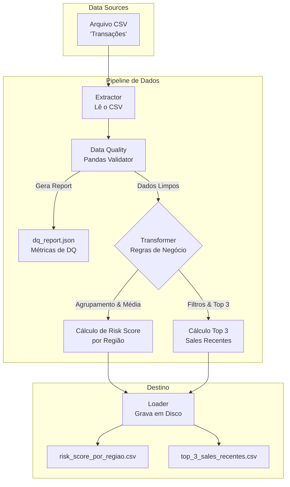
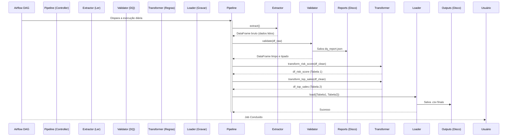

# 🚗 Locadora de Carros - Data Pipeline

Este projeto é uma solução completa de **Engenharia de Dados** desenvolvida para realizar a extração, limpeza, transformação e carga (ELT/ETL) de dados transacionais de uma locadora de carros. 

Foi desenhado sob rigorosos padrões de qualidade, com foco em **Alta Confiabilidade**, aplicando princípios de **Programação Orientada a Objetos (OOP)** e **SOLID**. Toda a infraestrutura roda de forma conteinerizada via **Docker** e a orquestração é totalmente automatizada utilizando **Apache Airflow**.

---

## 📊 Fontes de Dados e Saídas

### 📥 A Fonte de Dados (Input)
O pipeline ingere os dados a partir de um arquivo `CSV` que contém o histórico transacional da locadora. Ele entra no sistema através do diretório `data/input/`.
As principais colunas esperadas nesse dataset são:
- `timestamp`: A data e hora exata em que a transação ocorreu.
- `transaction_type`: A natureza da transação (ex: `sale` para vendas, `rent` para aluguel).
- `receiving address`: O endereço ou identificador único do recebedor (cliente/agência).
- `amount`: O valor financeiro da transação.
- `location_region`: A região geográfica onde a transação aconteceu (ex: SP, RJ, Norte).
- `risk score`: Uma pontuação de risco atribuída à transação (numérico).

### 📤 Os Produtos de Dados (Output)
Como resultado do processamento, o pipeline disponibiliza os dados em `data/output/` em formato `.csv` e relatórios em `data/reports/`. O valor de negócio gerado se divide nos seguintes artefatos:

1. **`risk_score_por_regiao.csv` (Tabela Analítica 1)**
   - **O que é:** Uma tabela agregada que consolida o nível de risco médio por região.
   - **Lógica aplicada:** Os dados são agrupados por `location_region`. A média matemática da coluna `risk score` é calculada e a tabela final é ordenada de maneira decrescente (da região com maior risco médio para a menor).

2. **`top_3_sales_recentes.csv` (Tabela Analítica 2)**
   - **O que é:** Um ranking de alto valor focando nos 3 maiores `receiving address` recentes de vendas.
   - **Lógica aplicada:** O motor filtra exclusivamente transações onde `transaction_type` é "sale". Em seguida, para cada endereço, retém apenas o registro com o `timestamp` mais recente. Desta sub-base purificada, seleciona-se o *Top 3* em volume financeiro (`amount`).
   - **Colunas geradas:** `receiving address`, `amount` e `timestamp`.

3. **`dq_report.json` (Relatório de Conformidade)**
   - **O que é:** Um payload JSON descrevendo a saúde dos dados no momento da ingestão. Contém total de linhas, quantidade de registros rejeitados (com erro de tipagem ou ausência de dados cruciais) e a taxa percentual de qualidade da fonte original.

---

## 🔄 Condução do Processo ELT (Extract, Load, Transform)

Embora a sigla moderna seja ELT (onde o Load no DW é feito antes), a arquitetura desenhada reflete um padrão robusto de **ETL (Extract, Transform, Load)** modularizado. A condução do fluxo foi dividida em 4 interfaces fundamentais baseadas no Single Responsibility Principle (SRP):

1. **Extract (Extração):**
   - A classe `CSVExtractor` é a responsável isolada pela leitura. Ela não sabe o que é feito com os dados depois. Se amanhã os dados vierem do Amazon S3 ou de um Postgres, basta criar um `S3Extractor` respeitando a interface, e o pipeline principal continua o mesmo.

2. **Data Quality & Cleansing (Qualidade e Limpeza):**
   - O `PandasDataQualityValidator` atua como uma barreira (Gatekeeper). Ele avalia os dados do Extractor, identifica valores nulos e verifica a tipagem correta da data (`timestamp`) e números (`amount`, `risk score`). Dados corrompidos são isolados e removidos do DataFrame de trabalho, gerando a "taxa de conformidade" (Compliance Percentage) registrada no report.

3. **Transform (Transformação de Negócio):**
   - Com dados 100% limpos e íntegros, o `BusinessTransformer` assume. Este módulo não faz I/O (leitura/escrita em disco). Ele recebe um DataFrame do Pandas em memória e gera as duas tabelas-resultado requeridas (`risk_score_por_regiao` e `top_3_sales_recentes`). É aqui que a lógica pesada mora e por isso é profundamente coberta por **Testes Unitários**.

4. **Load (Carga Final):**
   - O `CSVLoader` recebe um dicionário contendo o nome e o conteúdo de cada tabela-resultado para exportar de volta ao disco de forma persistente.

---

## 🏗️ Diagramas da Arquitetura

### 1. Fluxo Funcional dos Dados (Mermaid)
Este diagrama demonstra como a informação viaja, desde a leitura até as saídas processadas:



### 2. Orquestração e Componentes (Sequence Diagram)
Este diagrama foca no motor de execução, mostrando o papel do **Apache Airflow** na condução do processo:



---

## 📂 Estrutura Físico-Lógica do Projeto

O código está organizado seguindo Clean Code:

```text
locadora_de_carros/
├── .github/workflows/               # 🤖 Pipeline de CI (Integração Contínua) e GitHub Actions
├── dags/                            # ⏰ Configurações do Apache Airflow
│   └── locadora_pipeline_dag.py     # Definição da DAG agendada
├── data/                            # 🗂️ Camada de Storage (Ignorado pelo Git)
│   ├── input/                       # Dataset bruto
│   ├── output/                      # Produtos de dados finais
│   └── reports/                     # Arquivos JSON gerados pela validação DQ
├── src/                             # 🧠 Core / Aplicação Principal
│   ├── interfaces/                  # Classes abstratas forçando o padrão de dependências
│   ├── extractor/                   # Implementação do motor de leitura (CSVExtractor)
│   ├── quality/                     # Validador de dados (PandasDataQualityValidator)
│   ├── transformer/                 # Lógica de agrupamento e rankings (BusinessTransformer)
│   ├── loader/                      # Motor de gravação do resultado (CSVLoader)
│   └── pipeline.py                  # "Controller" que amarra interfaces e conduz o fluxo
├── tests/                           # 🧪 Suíte de Alta Confiabilidade
│   ├── unit/                        # Testes isolados das regras de negócio
│   └── integration/                 # Testes End-to-End simulando o ciclo completo
├── docker-compose.yml               # 🐳 Infraestrutura como código (Airflow services)
├── Dockerfile                       # Imagem customizada para o Worker (Python + Pandas)
├── requirements.txt                 # Manifestações de dependências do Python
└── arquitetura_locadora.drawio      # ✏️ Representação da Arquitetura para ser aberta no diagrams.net
```

---

## 🚀 Como Rodar o Projeto

Você tem duas opções: Simular o ambiente de produção (via Airflow + Docker) ou ambiente de desenvolvimento local (para testes).

### Opção 1: Via Docker & Apache Airflow (Produção Recomendada)
Toda a orquestração do pipeline é feita em containers, garantindo facilidade de execução em qualquer máquina.

1. **Subir os serviços:** Na raiz do projeto, digite:
   ```bash
   docker-compose up -d --build
   ```
2. **Acessar o Painel de Orquestração:** Abra seu navegador no endereço `http://localhost:8080`.
3. **Login:** Utilize as credenciais -> Usuário: `airflow` | Senha: `airflow`.
4. **Acionar o Pipeline:** Procure pela DAG chamada `locadora_pipeline_dag`. Ative-a (toggle *Unpause*) e clique no botão **Trigger DAG** (ícone de "Play").
5. **Verificar os Produtos de Dados:** Os resultados processados serão gerados dentro da pasta `data/output/` e o score de qualidade em `data/reports/`.

### Opção 2: Validação Local via Linha de Comando
Se você é um desenvolvedor e deseja validar a lógica sem subir a infraestrutura completa:

1. **Configurar Ambiente Python Virtual:**
   ```bash
   python3 -m venv venv
   source venv/bin/activate
   pip install -r requirements.txt
   ```
2. **Rodar a Suíte de Testes (Alta Confiabilidade):**
   Nosso ambiente contempla testes unitários e de integração validando desde componentes isolados até simulações reais do banco de dados (mocks).
   ```bash
   export PYTHONPATH=$(pwd)
   pytest tests/
   ```
